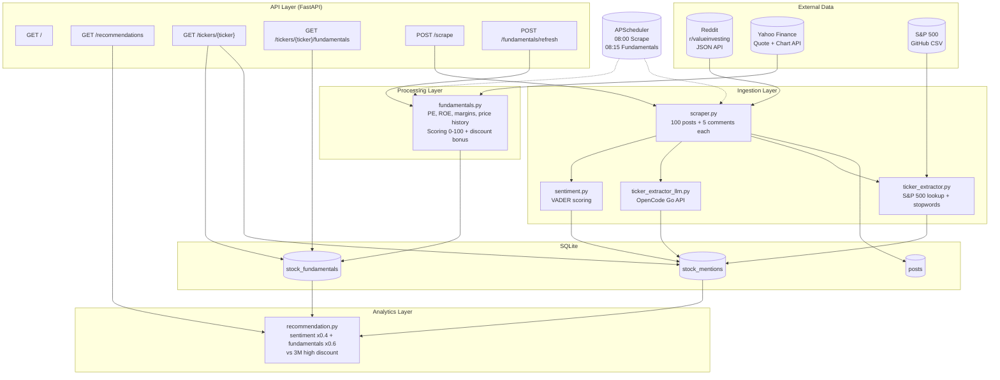

# Stock Sentiment API — Architecture & Tech Design

> **Version:** 1.0.0 | **Last updated:** 2026-08-03

## Changelog

| Version | Date       | Changes                                                                                                                                                                                             |
| ------- | ---------- | --------------------------------------------------------------------------------------------------------------------------------------------------------------------------------------------------- |
| 1.0.0   | 2026-08-03 | Initial release: Reddit scraping, regex + LLM ticker extraction, VADER sentiment, Yahoo Finance fundamentals, price history (1M/3M discount), recommendation engine, FastAPI endpoints, APScheduler |

## Overview

Automated pipeline that scrapes Reddit, extracts stock tickers, scores sentiment, fetches fundamentals, and generates ranked buy/sell recommendations.

## System Architecture



## Data Model

```
posts
├── id (PK)
├── reddit_id (unique, indexed)
├── title, body, author, url
├── score, num_comments
├── created_utc, scraped_at
└── mentions → stock_mentions (1:N)

stock_mentions
├── id (PK)
├── post_id (FK → posts)
├── ticker (indexed)
├── sentiment_score (-1 to +1)
├── mention_count
└── UNIQUE(post_id, ticker)

stock_fundamentals
├── id (PK)
├── ticker (unique, indexed)
├── pe_ratio, forward_pe, pb_ratio
├── debt_to_equity, revenue_growth
├── profit_margins, roe, market_cap, sector
├── price_current, price_1m_high, price_3m_high
├── discount_3m_pct
├── fundamentals_score (0–100)
└── updated_at

scrape_logs
├── posts_found, new_posts_saved
├── tickers_found, status, error_message
└── scraped_at
```

## Tech Stack

| Layer             | Technology                               |
| ----------------- | ---------------------------------------- |
| Web framework     | FastAPI 0.115                            |
| Server            | Uvicorn 0.34                             |
| ORM               | SQLAlchemy 2.0                           |
| Database          | SQLite (dev), Postgres (prod)            |
| Config            | Pydantic Settings                        |
| Scheduler         | APScheduler 3.10                         |
| Sentiment         | NLTK VADER                               |
| Fundamentals      | Requests (Yahoo Finance API)             |
| LLM extraction    | OpenCode Go (mimo-v2.5, $0.14/M tokens)  |
| Ticker validation | S&P 500 CSV (GitHub datasets, 30d cache) |

## Project Structure

```
stock-sentiment-api/
├── app/
│   ├── main.py              # FastAPI app, lifespan, router mounts
│   ├── config.py            # Settings from .env
│   ├── database.py          # Engine, session, get_db dependency
│   ├── scheduler.py         # APScheduler background jobs
│   ├── models/
│   │   ├── stock.py         # Post, StockMention, StockFundamentals, ScrapeLog
│   │   └── __init__.py
│   ├── routers/
│   │   ├── recommendations.py  # GET /recommendations
│   │   ├── tickers.py          # GET /tickers/{ticker}
│   │   ├── scrape.py           # POST /scrape
│   │   └── fundamentals.py     # POST /fundamentals/refresh
│   └── services/
│       ├── scraper.py              # Reddit JSON scraper + comment fetch
│       ├── ticker_extractor.py     # Regex + S&P 500 validation
│       ├── ticker_extractor_llm.py # LLM-based extraction (OpenCode Go)
│       ├── sentiment.py            # VADER sentiment scoring
│       ├── fundamentals.py         # Yahoo Finance fundamentals + prices
│       └── recommendation.py       # Composite scoring engine
├── scripts/
│   ├── test_scraper_and_ticker.py      # Quick smoke test
│   ├── aggregate_fundamentals.py       # Manual fundamentals refresh
│   └── generate_recommendations.py     # Print ranked table
├── tests/
│   └── test_ticker_extractor.py    # Unit tests
├── data/
│   └── tickers.json                # Cached S&P 500 symbols + name map
├── .env / .env.example
├── requirements.txt
└── README.md
```

## Data Flow (End-to-End)

```
1. APScheduler triggers scrape_subreddit() at 08:00
   │
   ├── GET old.reddit.com/r/valueinvesting/hot.json?limit=100
   ├── For each NEW post:
   │   ├── GET /comments/{id}.json?limit=5  (top comments)
   │   ├── Combine title + body + comments → post_text
   │   ├── Regex extractor: find S&P 500 tickers
   │   ├── LLM extractor: find company names → tickers
   │   ├── Merge & deduplicate → StockMention rows
   │   └── VADER sentiment → sentiment_score on each mention
   └── INSERT into posts + stock_mentions

2. APScheduler triggers aggregate_fundamentals() at 08:15
   │
   ├── Query DISTINCT tickers from StockMention
   ├── Filter: only tickers with updated_at > 12h old
   ├── For each ticker (1s delay):
   │   ├── GET Yahoo Finance quoteSummary (PE, ROE, etc.)
   │   ├── GET Yahoo Finance chart/6mo (price history)
   │   ├── Compute: 1M high, 3M high, discount %
   │   ├── Score: graduated heuristics (0–100)
   │   └── UPSERT into stock_fundamentals
   └── Log: updated N, skipped M

3. User requests GET /recommendations?limit=20
   │
   ├── JOIN StockMention + StockFundamentals (INNER)
   ├── Filter: sentiment_score IS NOT NULL
   ├── Normalize sentiment: (avg + 1) × 50 → 0–100
   ├── Composite = sentiment × 0.4 + fundamentals × 0.6
   ├── Rating: ≥85 Strong Buy, ≥70 Buy, ≥50 Hold, <50 Avoid
   └── Return JSON sorted by composite DESC
```

## Key Design Decisions

| Decision                              | Rationale                                                                                |
| ------------------------------------- | ---------------------------------------------------------------------------------------- |
| Regex + LLM dual extraction           | Regex is free/instant, LLM catches company names. LLM optional (no API key = regex only) |
| Separate fundamentals aggregation     | Not per-scrape — batched daily, 12h staleness check                                      |
| Sentiment normalization to 0–100      | Both inputs on same scale so composite has meaningful spread                             |
| Fundamentals base score at 25, not 50 | Creates wider differentiation between strong/weak companies                              |
| Discount bonus: 5-15% range only      | Avoids rewarding crashes (-30%+) or trivial dips (<5%)                                   |
| SQLite for dev                        | Zero config. Swap to Postgres for production                                             |
| .env for all config                   | No hardcoded values, easy to override per environment                                    |
